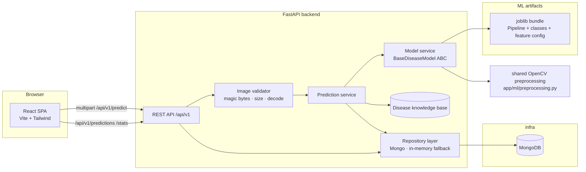
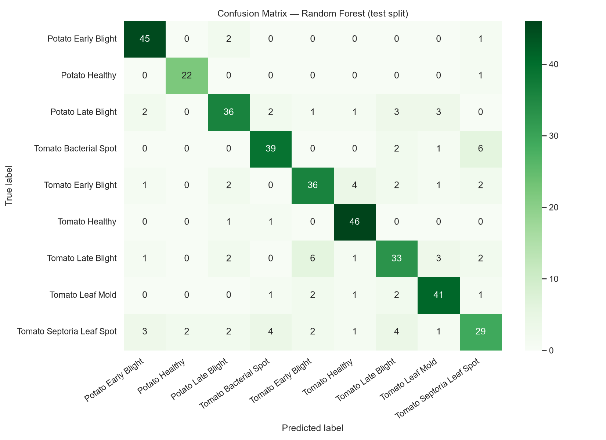
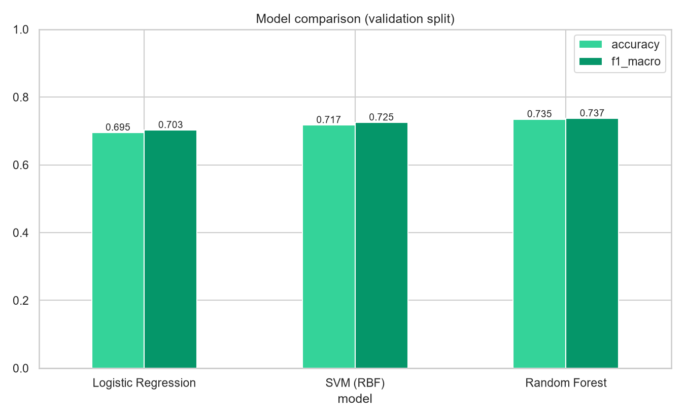
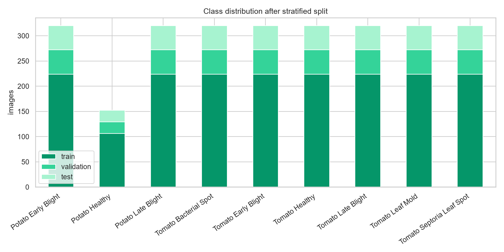
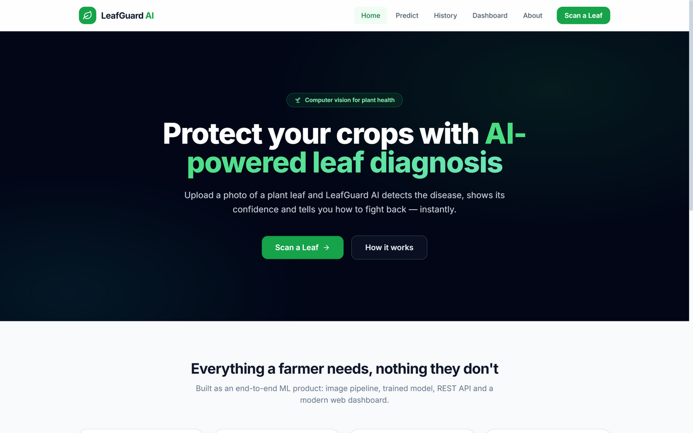
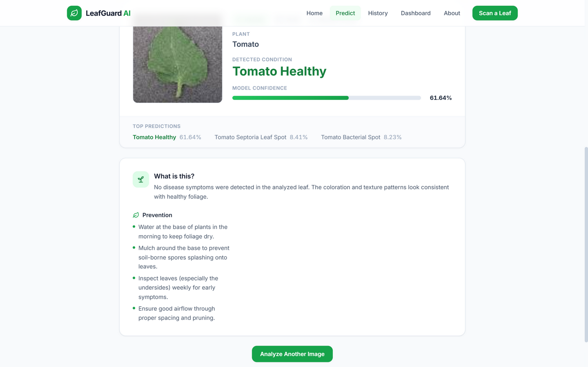
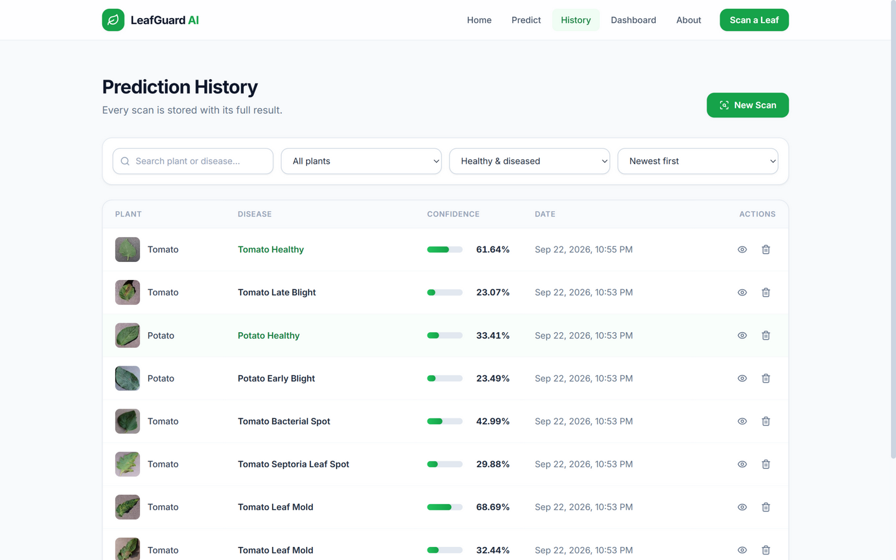
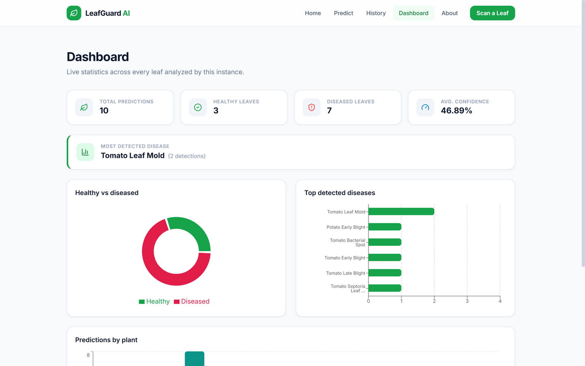

# 🌿 LeafGuard AI — Plant Disease Detection & Classification Platform

An end-to-end computer-vision product: upload a leaf photo, get the detected disease with a
confidence score, agronomic guidance, prediction history and live statistics. Built with a classical
ML pipeline (OpenCV + scikit-learn) behind a **FastAPI** API, a **React** frontend, **MongoDB**
storage and full **Docker Compose** orchestration.

> **All metrics below are real** — generated by `ml/training/train.py` on a held-out test split and
> stored in [`ml/evaluation/metrics.json`](ml/evaluation/metrics.json). Nothing is estimated.

## Features

- 🖼️ Drag & drop image upload with client + server validation (type, size, magic bytes, decodability)
- 🧠 Disease prediction across **9 classes** (tomato & potato) with confidence + top-3 alternates
- 📋 Curated agronomic info per disease: description, symptoms, prevention, treatment
- 🕓 Prediction history with search, filtering, sorting, pagination and delete
- 📊 Live dashboard: totals, healthy vs diseased, top diseases, per-plant counts
- 🧪 40 automated tests (backend / ML / frontend)
- 🐳 One-command Docker Compose deployment (frontend + backend + MongoDB)
- 🔁 Model-service abstraction — swappable with a CNN without touching the API contract

## Tech stack

| Layer | Technologies |
|---|---|
| Frontend | React 18, Vite, Tailwind CSS, React Router, Recharts, Axios, Lucide, Vitest |
| Backend | Python 3.12, FastAPI, Uvicorn, Pydantic v2, pymongo, pytest |
| ML | OpenCV, scikit-learn, NumPy, pandas, matplotlib, seaborn, joblib |
| Data & Ops | MongoDB, Docker, Docker Compose, GitHub Actions CI |

## Architecture



The exact same preprocessing module runs in **training** and **serving**, eliminating train/serve
skew. `BaseDiseaseModel` is the seam where a CNN can be plugged in later without API changes.

## ML pipeline

```
leaf.jpg → resize 256×256 → Gaussian denoise → HSV leaf mask (+ morphology, largest contour)
        → segmentation → features (1,836-D):
            • color histograms (H/S/V, 46)
            • channel statistics + lesion/chlorosis/edge ratios (16)
            • uniform LBP texture (10)
            • HOG on segmented leaf (1,764)
        → StandardScaler → PCA(95%) → Random Forest → probabilities
```

- **Dataset**: PlantVillage (color) subset — 2,712 images, 9 classes, stratified 70/15/15 split
  (1,898 / 407 / 407, seed 42). Full per-class counts: [`ml/dataset/processed/dataset_report.json`](ml/dataset/processed/dataset_report.json).
- **Model selection**: 3 candidates tuned with `GridSearchCV` (f1-macro); the validation winner is
  refit on train+validation and evaluated **once** on the test split.
- **Ablation**: the same model is retrained without denoising/segmentation to measure the
  preprocessing impact honestly (see results below).

## Results (measured, not invented)

**Validation split (model comparison):**

| Model | Accuracy | F1 (macro) |
|---|---|---|
| Logistic Regression | 69.53% | 70.26% |
| SVM (RBF) | 71.74% | 72.50% |
| **Random Forest (selected)** | **73.46%** | **73.71%** |

**Test split (final model, refit on train+val):**

| Metric | Score |
|---|---|
| Accuracy | **80.34%** |
| Precision (macro) | 80.64% |
| Recall (macro) | 81.23% |
| F1 (macro) | **80.83%** |
| F1 (weighted) | 80.04% |

**Serving performance:** mean 36.9 ms per prediction (p50 34.2 ms, p95 53.0 ms, CPU only),
model artifact 4.51 MB.

**Preprocessing ablation (honest finding):** removing denoising + segmentation changed test
accuracy by **0.00 pp** (ΔF1 macro +0.07 pp). PlantVillage images are pre-cropped with mostly
uniform backgrounds, so background removal adds nothing *on this dataset*. The steps are kept
because real-world photos have cluttered backgrounds, and the null result is reported rather than
hidden.

<p align="center">
  
  
</p>
<p align="center">
  
</p>

## Screenshots

| | |
|---|---|
|  |  |
|  |  |

## Quickstart

### Prerequisites
- Python 3.12+, Node.js 20+
- MongoDB (optional — the API falls back to in-memory storage with a logged warning)
- Docker Desktop (for the containerized stack)

### 1. Train the model (produces the required artifact)

```bash
python ml/scripts/download_dataset.py     # ~2,700 PlantVillage images (~120 MB)
python ml/scripts/prepare_dataset.py      # stratified split + report
python ml/training/train.py               # trains, evaluates, saves artifacts + charts
```

### 2. Run the backend

```bash
cd backend
python -m pip install -r requirements-dev.txt
uvicorn app.main:app --reload --port 8000
# Swagger UI → http://localhost:8000/docs
```

### 3. Run the frontend

```bash
cd frontend
npm install
npm run dev       # → http://localhost:5173
```

### Environment variables

Copy [`.env.example`](.env.example) → `.env` (backend) and `frontend/.env.example` → `frontend/.env`.

| Variable | Default | Purpose |
|---|---|---|
| `MONGODB_URI` | `mongodb://localhost:27017` | Mongo connection (falls back to in-memory if unreachable) |
| `DATABASE_NAME` | `leafguard` | Database name |
| `MODEL_PATH` | `backend/app/ml/artifacts/leafguard_model.joblib` | Trained bundle path |
| `FRONTEND_URL` | `http://localhost:5173,…` | CORS origins (comma-separated) |
| `MAX_UPLOAD_SIZE_MB` | `10` | Upload size limit |
| `VITE_API_URL` | `http://localhost:8000` | API base URL for the React app |

### Run everything with Docker

```bash
docker compose up --build
# frontend → http://localhost:3000      API → http://localhost:8000/docs
```

> The trained artifact (`backend/app/ml/artifacts/leafguard_model.joblib`, ~4.5 MB)
> **is committed**, so the stack runs without training. To retrain and regenerate
> every metric/chart yourself, run the three commands in step 1 — if the artifact
> is missing the API starts degraded (`/health` → `model_loaded: false`, predict → `503`).

### Deploy to the cloud (free)

A public demo can be hosted for $0 using MongoDB Atlas + Render + Vercel —
click-by-click instructions in [DEPLOY.md](DEPLOY.md).

## API

Base URL `/api/v1` — interactive docs at [`/docs`](http://localhost:8000/docs).

| Method | Endpoint | Description |
|---|---|---|
| GET | `/health` | Service, model and database status |
| POST | `/api/v1/predict` | Analyze a leaf image (multipart `file`) |
| GET | `/api/v1/predictions` | History — `page`, `page_size`, `search`, `plant`, `status`, `sort` |
| GET | `/api/v1/predictions/{id}` | Single prediction |
| DELETE | `/api/v1/predictions/{id}` | Delete a prediction |
| GET | `/api/v1/stats` | Dashboard aggregates |

```bash
curl -X POST http://localhost:8000/api/v1/predict -F "file=@leaf.jpg"
```

```json
{
  "success": true,
  "prediction": {
    "id": "6ab2b7d40a765fc2bbf14a0a",
    "plant": "Tomato",
    "disease": "Tomato Early Blight",
    "is_healthy": false,
    "confidence": 66.34,
    "processing_time": 0.04,
    "top_predictions": [...]
  },
  "recommendation": {
    "description": "Fungal disease caused by Alternaria solani…",
    "symptoms": ["Brown spots with concentric rings…"],
    "prevention": ["Mulch to stop soil spores…"],
    "treatment": ["Apply labeled fungicides…"],
    "severity": "medium"
  }
}
```

Errors are always the same shape:

```json
{ "success": false, "error": { "code": "INVALID_IMAGE", "message": "Please upload a valid leaf image." } }
```

Error codes: `INVALID_IMAGE` (422) · `UNSUPPORTED_FILE_TYPE` (415) · `FILE_TOO_LARGE` (413) ·
`MODEL_NOT_LOADED` (503) · `NOT_FOUND` (404) · `VALIDATION_ERROR` (422) · `INTERNAL_SERVER_ERROR` (500).

## Testing

```bash
cd backend  && python -m pytest        # 20 tests (API, validation, repositories, real-model integration)
cd ml       && python -m pytest        # 10 tests (preprocessing, features, model service)
cd frontend && npm test                # 10 tests (uploader, result card, API error mapping)
```

CI (GitHub Actions) runs backend tests + frontend tests/build on every push.

## Project structure

```
LeafGuard AI/
├── frontend/                  # React SPA (Vite + Tailwind + Recharts + Vitest)
│   └── src/{api,components,pages,layouts,hooks,utils,__tests__}
├── backend/
│   ├── app/
│   │   ├── api/routes/        # health, predictions, stats
│   │   ├── core/              # config, logging, exceptions
│   │   ├── models/            # domain records
│   │   ├── schemas/           # Pydantic API contract
│   │   ├── services/          # prediction orchestration, upload validation
│   │   ├── repositories/      # PredictionRepository ABC → Mongo / in-memory
│   │   ├── ml/                # model service + SHARED preprocessing + artifacts
│   │   ├── utils/             # image helpers (thumbnails)
│   │   └── main.py
│   ├── tests/                 # pytest suite
│   └── Dockerfile
├── ml/
│   ├── scripts/               # download_dataset.py, prepare_dataset.py
│   ├── training/train.py      # training + evaluation + charts (single entrypoint)
│   ├── dataset/{raw,processed}/
│   ├── evaluation/            # metrics.json, reports, PNG charts
│   ├── models/                # artifact backup
│   └── tests/                 # ML pytest suite
├── docs/screenshots/
├── .github/workflows/ci.yml
├── docker-compose.yml
└── README.md
```

> **Note:** the preprocessing code lives in `backend/app/ml/preprocessing.py` and is *imported by
> the training scripts* — a deliberate single source of truth to prevent train/serve skew.

## Resume bullets (based only on shipped features & measured results)

- Built an end-to-end plant-disease detection platform (React, FastAPI, MongoDB, Docker Compose)
  with an OpenCV + scikit-learn pipeline reaching **80.3% test accuracy / 0.81 macro-F1 across 9
  disease classes** on a held-out PlantVillage split.
- Designed a 1,836-dimensional color/texture/gradient feature pipeline (HSV histograms, channel
  statistics, uniform LBP, HOG) and selected the best of 3 tuned models via stratified
  cross-validation; documented an honest preprocessing ablation (±0.0 pp on curated data).
- Achieved **~37 ms CPU inference (p95 53 ms)** with a 4.5 MB artifact by loading the model once at
  startup behind a swappable `BaseDiseaseModel` abstraction, keeping the REST contract CNN-ready.
- Hardened the upload path with magic-byte + decodability validation and consistent typed error
  responses; covered the system with **40 automated tests** across API, ML and frontend suites and
  GitHub Actions CI.

## Future improvements

- CNN / MobileNetV3 backbone behind the existing `BaseDiseaseModel` interface
- User accounts & per-user history, cloud object storage for originals
- Model versioning + drift monitoring, Kubernetes manifests, AWS deployment
- More crops (pepper, grape, corn) — the API already renders unknown classes generically

## Limitations

- Classical features plateau around ~80% on this subset; fine-grained confusions remain between
  visually similar fungal spots (see confusion matrix).
- Trained on PlantVillage (lab-style photos); expect a drop on field photos.
- The in-memory fallback (used when MongoDB is unreachable) loses history on restart by design.

## License

[MIT](LICENSE) — dataset: [PlantVillage](https://github.com/spMohanty/PlantVillage-Dataset)
(CC-BY-SA research data, downloaded as a subset; see `ml/dataset/raw/download_manifest.json`).
